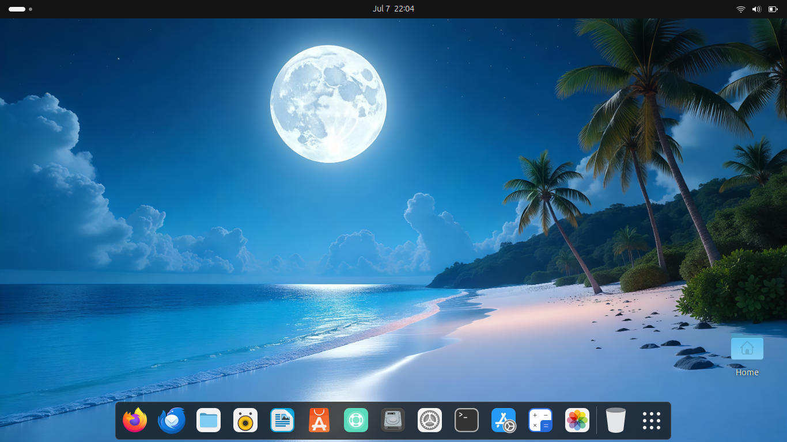

# PineappleOS


PineappleOS - is an operating system based on Ubuntu, which combines all the best features of modern systems for better performance and ease of use.

## Light Theme
 

## Dark Theme


## Download ISO
[Download PineappleOS](https://drive.google.com/file/d/1vhXfDbbHK98WqOvkKnFbFuYJXyHE96kx/view?usp=sharing)

## How to create ISO
### 1. Install Cubic
```bash
sudo apt-add-repository universe
sudo apt-add-repository ppa:cubic-wizard/release
sudo apt update
sudo apt install --no-install-recommends cubic
```
### 2. Download original Ubuntu ISO from [official web-site](https://ubuntu.com/download/desktop)
### 3. Download [zip with sources](https://github.com/VladislavBanitsky/PineappleOS/archive/refs/heads/main.zip)
### 4. Unpack the archive
### 5. Launch Cubic, create and select directory, click Next, select original ISO, click Customize
### 6. Customize the dock panel
```bash
cd /usr/share/glib-2.0/schemas
```
Then drag and drop ```10_ubuntu-dock.gschema.override``` and click Copy.
### 7. Adding wallpapers
While remaining in the same directory, drag and drop the ```10_ubuntu-settings.gschema.override``` and click Copy.
```bash
cd /usr/share/gnome-background-properties
```
Drag and drop ```noble-wallpapers.xml``` and click Copy.
```bash
cd /usr/share/backgrounds
```
Drag and drop ```summer-beach-dark.jpg``` and ```summer-beach-light.jpg``` and click Copy.
### 8. Installing logos
```bash
cd /usr/share/plymouth
```
Drag and drop ```ubuntu-logo.png``` and click Copy.
```bash
cd themes/spinner
```
Drag and drop ```watermark.png``` and ```bgrt-fallback.png``` and click Copy.
```bash
cd /usr/share/icons/Yaru/scalable/places
```
Drag and drop ```start-here-symbolic.svg``` and click Copy.
### 8. Click Next, then waiting, then on tab Boot change name OS to PineappleOS in ```loopback.cfg``` and ```grub.cfg```.
### 9. Click Next, then waiting while ISO image will be generated in directory, which you created on the 5 step.
### 10. Create a bootable USB flash drive, install the system with installing all updates and enjoy :)
